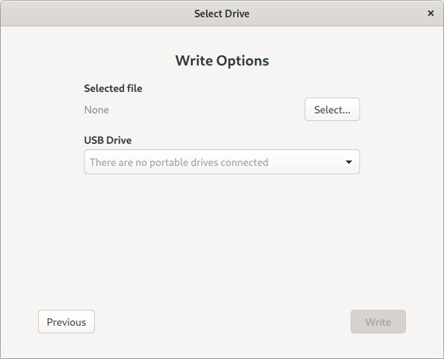

## A guide on how to setup a Rasspberry Pi, connect with SSH and create SSH keys.

I did a college project a few years ago where I had to get a Raspberry Pi and collaborate with other students; since then, I’ve kept the Pi and use it for various things that might be useful.

For those who don't know, the Raspberry Pi is a small device that fits in the palm of the hand. It can do various things, such as act as an assistant voice, a security camera, a home file server, an ad blocker, and many other things. You just need to find out what you really want to do with it. It can be a fun project or an educational project; it's up to you.
 
 
Pi is used mainly with Linux operating systems, windows 10/11 can be used to but its not recommended. There are a lot of Linux operating systems out there for the Pi; with a bit of research, you can find the one that fits for you, I have used the raspberry pi OS previoursly, and thats the one I'm going to install.

### Let's get started!

To begin I'm gonna need the SD card and the ISO of [raspberry pi OS](https://www.raspberrypi.com/software/), next I'm gonna insert the SD into my USB and plug it in my computer. Now  I need to write the ISO into my SD, this can be done with a media writer, the website provides writers, but since I'm I use Fedora OS I will use fedora media writer app.
Once the application opens, I click select ISO file > Next > Select File(your ISO) > USB Drive(your USB or SD) and click write.
I have to wait couple minutes and its done.

    

### I'm ready go!

Next, I will insert the SD card in the pi, plug in the HDMI cable, the Ethernet cable, mouse, keyboard and the power cord. I have an on and off button; I will push it, and off we go. I'm installing the graphical user interface, which means I can use my mouse and keyboard to do tasks if necessary. 
The installation is simply, select country, time/timezone and set password. 

Next thing I'm gonna need is SSH access.

FYI*: SSH is a network protocol used for remote login and command line execution, its the easiest way to control remote machines and servers without needing to be there.

By default rasspbery pi does not allow ssh, so I have to enable it by clicking the rassbpery icon > preferences > rassbpery pi configuration, interfaces and where it says ssh click enabled. 

 

For users in CLI mode, they can use "raspi-config" commmand, choose interface options  > SSH > select Yes and press enter.
   

Before I disconect the usb cables from the pi, I have to find the IP of pi, to do that I will open the terminal and type **ip a**, as you can see from the next picure eth0 has the internal IP 192.168.2.36.

 

### Last steps!
I pulled all the usb cables and now I'm ready to connect remotely using SSH. 
On my computer I will open the terminal and type this command **"ssh antonis@192.168.2.36"**,in your case change the command and add your username and IP, the first time it will ask you if you realy want to connect and then it will ask for your password, type yes and press enter then type your password, just a reminder, that when you type the password no letters, asterics or dots are shown on the screen.
 

For windows: Windows 10/11 users can use Command Prompt or download PuTTy, on Command Prompt you can use the same command as shown before, for PuTTy follow the instruction in the website.

Every time that I will SSH into my rasspbery pi it will ask for the password, to avoid this and make it easier I will to generate SSH Keys from my computer, I will open a second terminal on my computer and type **"ssh-keygen -t rsa"**, since this is on a home network I will just press enter on every prompt, next I will copy the public key into the pi, the command I'm gonna use for this is **"ssh-copy-id -i ~/.ssh/id_rsa.pub antonis@192.168.2.36"**, the -i option allows to pick a public key of our choise.
I'm ready to go, I will exit from the other terminal and ssh again, as you see no prompt for password at all.

 

Disclaimer: This is intended for a home use and easy access, thats why I didn't use password. IF you have a server its recommended to have a password with your ssh key, also its good for you to disable password login and enable/use only ssh key login, this way you can stop strangers from trying to ssh into your server, but this is not the end, change your ssh port number from 22 to something of your choise. Those are some of the basics, people who work or study about networks, linux and windows OS must know how to protect their servers. 

### The ending
As we know every home router uses DHCP to hand IP on every computer, smart tv, smart phone and so on, after some time DHCP hands a new ip on every device, thats a problem if I SSH with IP, to fix that I will open the dhcpcd.conf which is located in /etc/ and type ip address, static routers and domain servers, this way the IP will stay the same and I will not worry in the feature. 

FYI: I used VIM editor to edit the file **(sudo vim /etc/dhcpcd.conf)**, but for new users its recommended to use NANO.

### Last Words
The above demonstration is a basic setup, anyone with not or a little bit of experience can perform this tasks, not to mention there a lot of websites with the same instructions. 
Rasspbery Pi is a great machine to enter the world of computers, from programing to network and robotics, you can learn many things and it may become your hobby.

I reccomend you to visit the official website and find more ideas on where to [start.](https://projects.raspberrypi.org/en)

