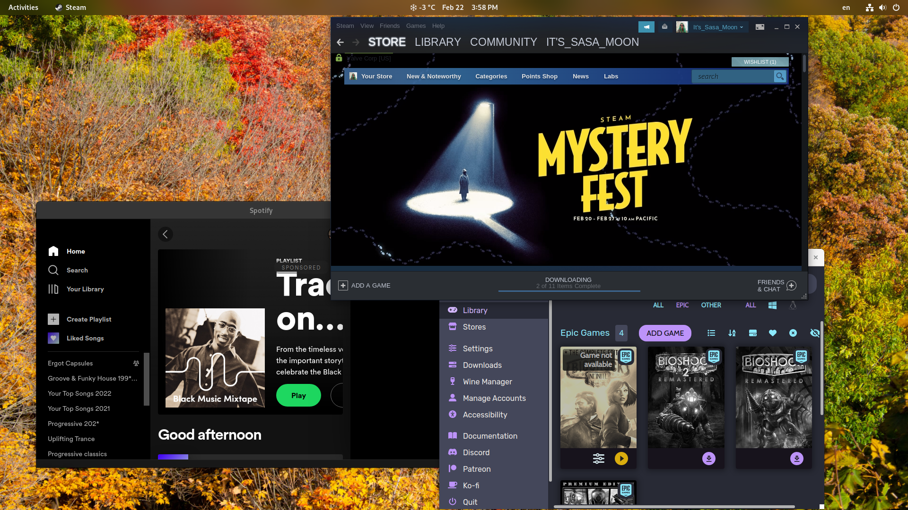

### My every day operating system!

My first computer had Windows 2000, and after that I got a new computer with Windows 7; Windows 7 was the best OS I had at the time. A few years later I got a laptop and installed Windows 10; it was a hard no from me, but since Windows 7 had an EOL (End Of Life) date, I did adapt with Windows 10.
 Not far later I discovered GNU/Linux, it was free and easy to install, the only problems was gaming and application support.  That didn't put me down, so I tried Ubuntu, and I was amazed, new interface, side bar, firefoxe pre installed and most importantly it had SUPER BUTTON.
 
Ubuntu was great, as I said before I was amazed, but didn’t take long till I found other  distros like Mint, Parrot os, KDE, Fedora, Arch, Gentoo and many more.

At this point, I had created virtual machines for each distro in which I was interested, and I spent a lot of time playing with them to make sure I had everything I needed. In the end, I picked Fedora because it was the best fit for me.
Today, I still use Fedora as my primary distro, and I do things like browsing the internet, sending emails, video editing, text editing, and so on. 
I want to mention that I have a dual boot, which means I have Fedora 37 and Windows 10 booth installed, but I awlays boot Fedora.

Furthermore, I will show you my desktop through images and  text.

This is my login interface, fedora has a black screen on login page by defaut, but with blur my shell extension  you can change it to something like this.
 

This is my desktop, you will notice temperature, date, time, the activities button and settings far right. By clicking on date I can access notifications, calendar and weather in more detail. 
Using this interface daily, I find it easy and useful to operate. 
 

When I press the super button, otherwise known as windows button, I can see all the applications open at this moment, I can also move to my second desktop screen, if I press the supper button again it returns back to where I was, you will also notice the bar down, its very useful to pin apps or find and click an app thats already open.
I can’t describe how much I love the supper button, its fast and gives multiple options at once. 
 

## Apps

GNU/Linux has done a big progress is the last years, more apps are available to the users.  As you can see in the photo, I use RawTherapee to edit high quality photos, such as the ones I shoot with my dsrl, next app is Kdenlive, a very useful and easy app to make and edit videos, finally I’m using krita to edit or paint anything I want. 
Ofcourse fedora provides basic apps like clock, weather and  document scan that helps with every day small tasks.
 

##  Music and Gaming

Music and gaming are part of my life, for music I use the spotify app, and for gaming I use steam with proton and  heroic games. Gaming works perfect with no problems most of the times, might get some glitches from time to time, but nothing to worry. The best part was using my logitech  g27 gaming wheel, I used to play games like Euro Truck Simulator 2,  Assetto Corsa and F1 2015.
I want to mention here that all the games I play are supported by proton. 
 

## Text editors

To replace Microsoft Office, Fedora has pre-installed  LibreOffice, its a free and open source productivity software suite, it can really do everything I need to, writing, excel formulas and so on.
The best part is that it saves me tons of money.
 

Overall I have an amazing experience so far, everything works smooth, I turn on my computer and I work as I would with Windows 10/11. I have a dual boot Fedora 37 with Windows 10, and sometimes when I need  a job done that can’t be done with Fedora, I use Windows, but I always boot Fedora.

