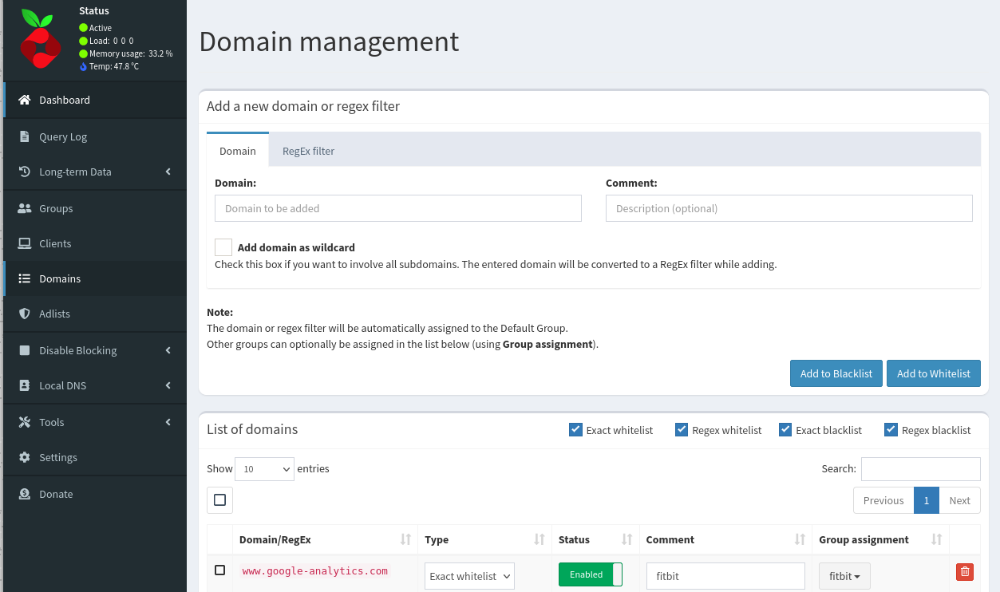

Looking just for the answer? Go to the end of this article! if not continue reading.

I have owned a Fitbit Versa 2 for quite a while, and everything works really well. Having it on the same network with a pihole means changing clock faces won't be possible.

### How did I get into this problem? And how I tried to fix it.
I wanted to search for a new clock face, which from versa 2 itself, can't be done. Instead, I had to use the app to search and install a new one, and there I came upon a message "Oops looks like there is no Internet connection" (See picture bellow). This was a familiar message to me, since I had seen it again in the past and I had fixed it.
In the beginning, it looked easy. I started by creating a group named Fitbit (see pictures below), then went to Domains and added www.google-analytics.com to be whitelisted, and I assigned Fitbit as a group. Finally, I went to the clients tab, clicked on known clients, searched for my device through its IP and MAC address, and assigned all groups to it.

 
 
 
 

### Did it work? If not, what do I do?
While in the past, this would have done it, this time didn't work!
I opened the app again and got the same error. Now I clicked a couple times to retry, and I checked the query logs on the Pihole interface. I saw that www.google-analytics.com was green, which means it is ok to go, but cdn.optimizely.com is red, which means it is blocked. I was not 100% sure, but I double checked by googling, and I saw that this domain should be whitelisted. So I whitelisted as I did before (Domains > type domain > add to whitelist > assign group fitbit only), then I pressed retry, and it finally worked!

 
 

### Its working!
As you can see its finally working as it should! 
Whitelisting these two domain names did the trick.

### Solution
All you need is to whitelist these two domains in your pihole, and should be good to go!
cdn.optimizely.com
www.google-analytics.com
