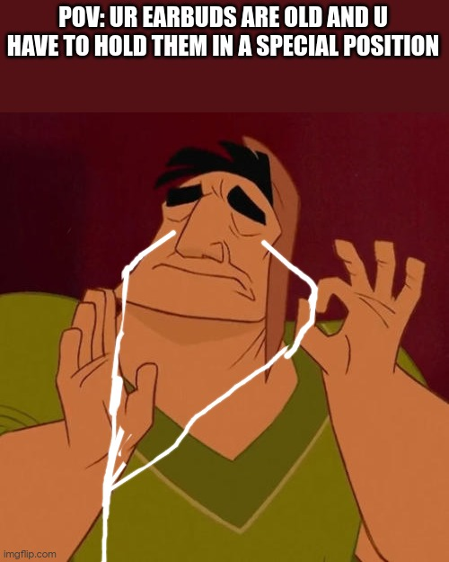
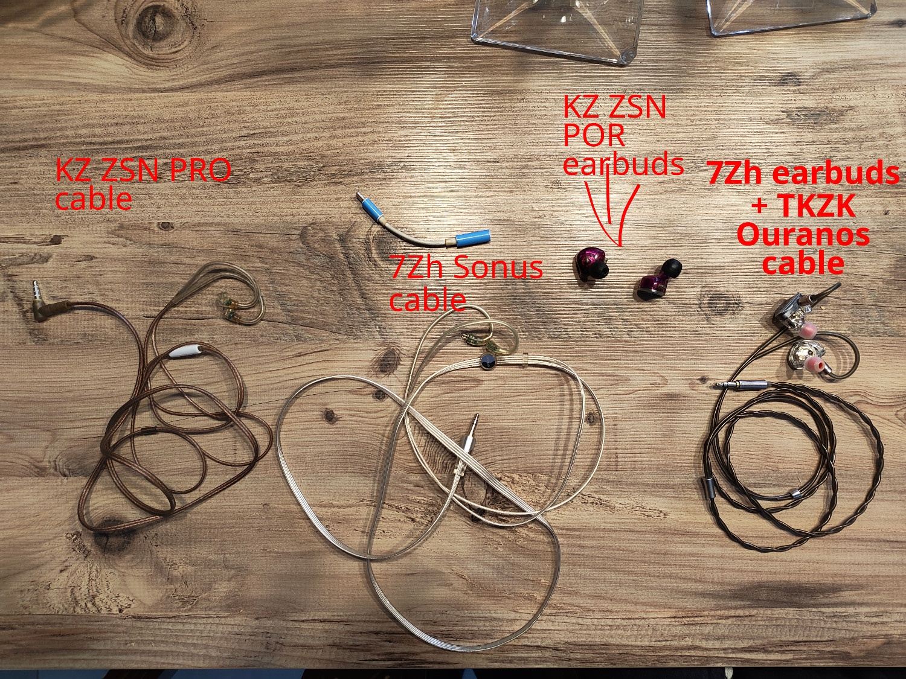
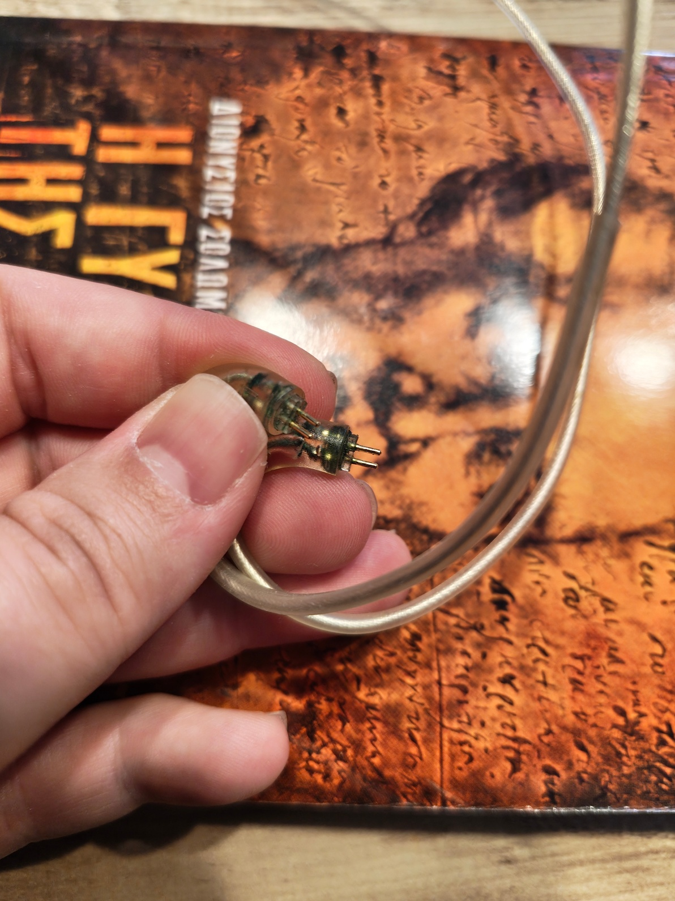
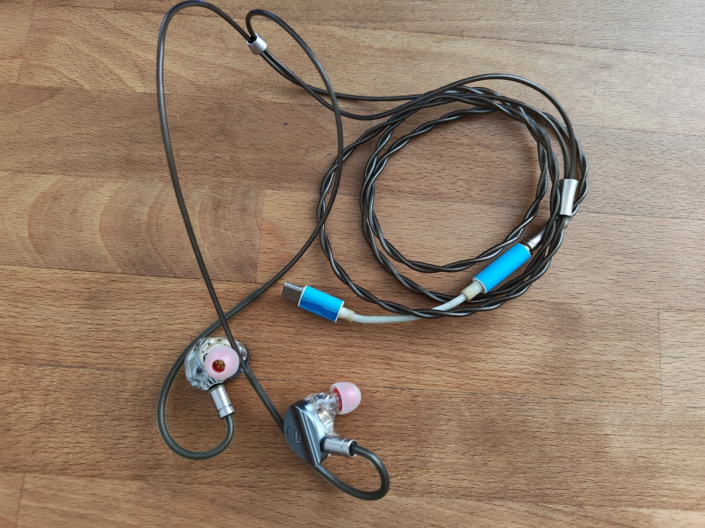

---
layout: post
title: My wired earbuds are broken once again!!
categories: [earbuds, iem, music, fix]
---

A post about IEM's and a quick fix 

Once again, my wired earbuds are broken. The thing is, I always had bad luck with earbuds, and especially with IEM's (In-ear monitor), starting at a very young age, when my dad bought me a 10 euro wired no-name earbud back then, and weeks after, the right earbud cut off (don’t ask how, silly young me). Many years later, I got my first iem’s, which I was amazed by the sound, blasting music all day long, but the cable broke, it needed to be held left and right, and like that my other item broke down. 
Bad luck can be one factor, but the way iem’s are folded so they can be put in the pouch, is another way (folding them round).

So now what??? Should I buy a new one? Should I fix them? Whaaaat?

So even if I want to fix them, I  can’t. Depending on the problem, I  either buy a new pair, a new cable or make a mix with the old ones you have.

My first item was the KZ Zen Pro, a basic entry and a cheap item that would perform well, but nothing like my second one, TKZK Our anus, which I think I paid 50 cad$, and the detail was so much better. I loved the sound and the cable was flexible, but still not good as my third item, 7Hz Sonus at 83 cad$, that had more detail on the sound, and it delivers on anything I was looking for. 
As I mentioned earlier, all of them broke one way or another, but the one thing I could always do, was to mix them up. In my last pair of Sonus 7Hz, the cable on the top of the right side was causing a cut of sound periodically when moving, which means the solution is to change cables!
  

I took the cable for the TKZK Ouranus and my Sonus 7Hz earbuds and put them together, easy as that, plug and play. The common thing that most items have, is the 2-pin cable, where you just plug it in, and you are ready to go. If you own more than 2 items, it’s a great way to fix the problem and avoid buying a new one if you can’t afford it. 

Everything I own, except the Ouranus earbuds (I have them in the closet).
 

Two things to mention here are that some 2-pin cables sometimes may have different sizes, meaning when looking for or buying new IEM’s, be sure to check the description about the size of the 2-pin. And, some companies may wrap the 2-pin with plastic around, as part of the design, and leave only a couple CM exposed, making it unable to be used with other earbuds.
Here is an image of a 2 pin cable, where the earbuds plug in.
 

IEM's might not be like the big headphones, where they cover the ear, and minimize the outside sounds, but when talking about quick fix, it can be very easy. And to be true, I had once some cheap bluetooth earbuds, which never fited good in my ears (same goes for iems), but once water fell over, no way to fix them like iems. 
 
