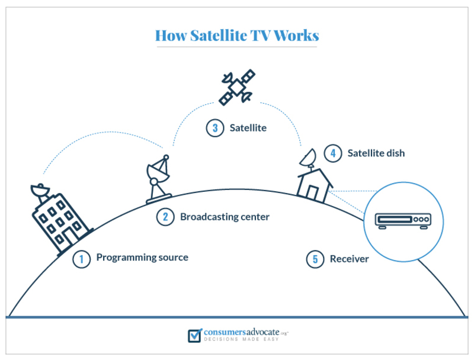
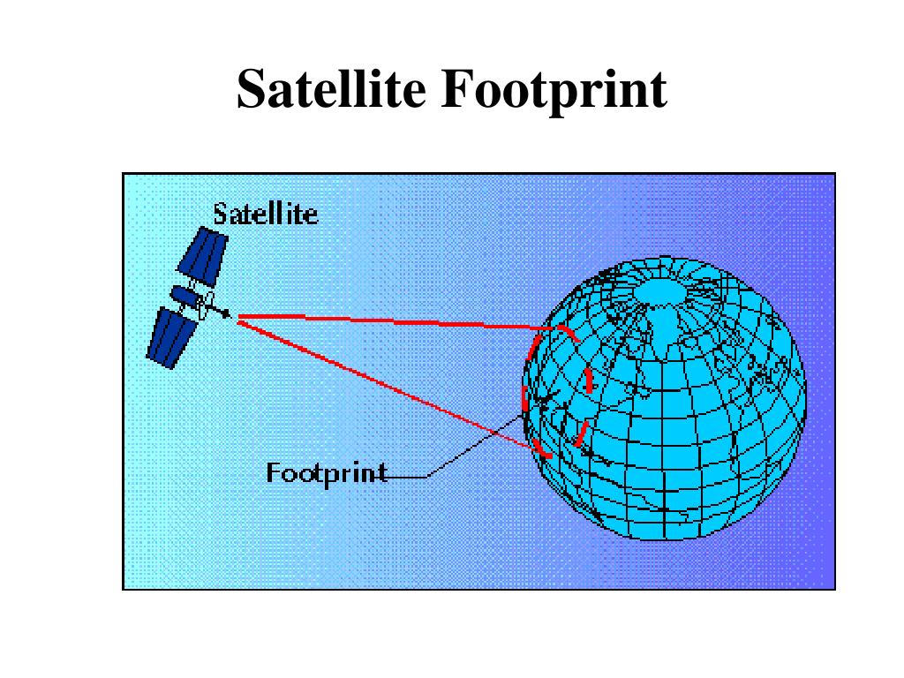
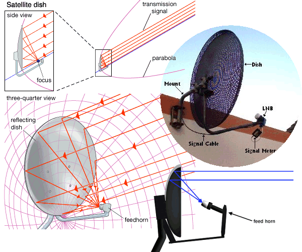
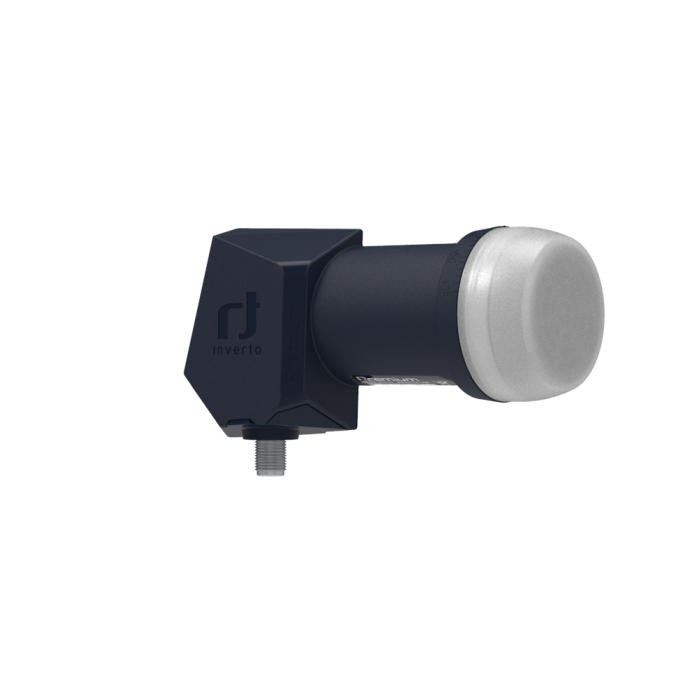

When I was a kid, the internet was not a big thing as it is today, people used to watch a lot of TV, we would need, of course, a TV and a terrestrial antenna or a satellite dish. Terrestrial antennas were most used back then, because first, they were cheap, and second, we could get all the channels in no time.\
Some people would install it by themselves and would be ready to go, others would call a technician and do it for them. We would get lots of channels on terrestrial, but not as many as on satellite, where we would get hundreds of channels, from your own country to your neighborhood countries and it goes on.

While nowadays internet has taken over, here in Greece TV is still big medium to get news, watch series (Greek series only) and live sports. Terrestrial is as usual most used, but satellite TV comes after with its high-quality image.\
People tend to think that satellite TV is dead, a thing that people used to watch back then, and that now everyone uses 1Gb/s Fiber internet connection to watch movies, series and live sports.

These people are wrong! Satellite TV is not over.\
Satellite TV is a preferred for places like rural areas, towns and cities, where Fiber or VDSL is not available and ADSL can’t do much. 
 
What can Satellite TV do nowadays?\
Nowadays, satellite TV provides HD, FHD even UHD 4K resolution! Some channels allow playback (depending on the provider), where you can pick a movie or a series and watch them.\
You might say, OK?! So what?\
For events like sports, concerts and many other things, this is more than amazing, because of the resolution and, of course, because there is no delay or lag!

In this guide, I will explain how satellite TV works, and what tools a person will need to setup a satellite dish. There will be another post on how to set it up of course.

## How satellite TV works:

The TV station uses a camera to capture the program, then, through a cable, it goes to the monitor room/server, and from there to a big satellite dish that transmits the content to a which is positioned in geostationary orbit above the earth. The signal that comes from the station, get transmitted back to Earth, where satellite dishes wait for it to come, and then it goes through the cable to reach the box and the TV.
 

What you need to know before setting up the dish:

To setup a dish, you need first to know which satellite are you pointing to. Depending on where you are, you might want to do a search first, and find channels that you are interested to watch.\
A a web search engine can help you, but I would say go for channels from you country.\
For the purpose of this guide and my interest, I will use the well-known Hellas Sat 3/4 at 39.0 east. This satellite has Greek channels, Romanian, Bulgarian and some Italian channels free to air.	

## Footprints: 

The first thing you want to know is if the satellite's footprint. In my case, by visiting satbeams.com > footprints > select Hellas Sat 3/4 > Europe, I can see that all the European beams are available where I live (Athens).\
As the name suggests, “Hellas Sat”, this satellite was designed for Greece, but it also has coverage for Romania and Bulgaria based on the beams.

Now let’s find the satellite dish size I/we will need.
This can be done easily by going back to Lyngsat. all the way down by clicking “Lyngsat maps” and selecting Europe > 39.0E 3 or 4 > Europe again.\
As you can see, Lyngast provides almost the same maps as satbeams, but with dish size depending on where you are. In my case, in Athens, I will need a 50cm or bigger dish to have a good signal.

The general rule is: in the center of the footprint, a small dish, as you get outside you will need a bigger dish. But still, it’s always recommended to buy a big dish to get a better signal.

## LNB (Low Noise Block downconverter):
So we have checked that we are in footprint, that we can get a signal from Hellas Sat 3/4, and the recommended size of the dish we need, 50cm. What’s next? LNB, Low Noise Block downconverter!

I did explain and provide a photo of how satellite TV works, but I didn’t explain how it goes from the dish to the box. The radio waves hit the dish, and then the LNB catches the RW, which then travels to the box through the cable. That’s why the dish is curved, and that’s why the Lab sits in the middle collecting all the incoming radio waves.\
Here is photo to visualize it even better.

Types of  LNBs:
If you have a single box, a single LNB will do just fine, but if you have more than one box, for example, 1 in your living room and 1 in your bedroom, then you are going to need a twin LNB, which has 2 outputs. Of course there are LNB’s with more outputs, see below.\
Single LNB: 1 output\
Twin: 2 outputs\
Quad: 4 outputs\
Octo:  8 outputs \
Unicable: Capable of delivering signals to multiple receivers through a single cable. (More info here https://www.linuxsat-support.com/)cms/article/34-guide-to-using-unicable/\
Monoblock: independent LNBs in a single housing, allows a user the potential of receiving the signal from two different satellites which are at slightly different orbital opposition from a single dish installation.\
Duo LNB: A double LNB for simultaneous reception. For example Astra 23.5E and Astra 19.2E at the same time.

LNB Frequency ranges:
Most of the satellite/channels are using Ku bands, which are at 9750MHz-10600MHz, but you will find also C-band and Ka-banks with different frequencies. Check with lyngsat to see what bands the channels you want to receive are.
C-band: 5150 MHz\
Ku-band:  9750MHz-10600MHz\
Ka-band: 20.2 GHz, 21.2 GHz (varies)\
techretry.com/lnb-frequency-guide-for-satellite-tv-signals/

For example, my LNB Inverto universal, falls under Ku-band and works perfect on HotBird 13.0E.\
An actuall LNB

## Finding the satellite and a satellite finder device:

The app\
Somewhere in the sky, Hell as Sat is waiting for us to catch its signal. How do we find it? Where is it?\
We could use a compass and do a couple of calculations, but for the guide and to make everybody's life easier, I recommend you to download any app called “satellite finder”, and use its compass to find the satellite's direction. Simply, easy and quick.\
You simply select the satellite, and it will see you where you need to point.

Satellite finder device\
While the app can point you in the direction, you still need a finder device. It’s VERY important to have one, otherwise it’s a shot in the stars, meaning you don’t know what you are doing, which satellite you are on and so on.\
Such devices have many useful features on them, starting with satellite scanning, recognizing the transponder/satellite and analyzing the signal. You don’t have to run up and down scanning on your tv.\
I own a gtmedia satellite V8 Finder 2, which I bought a year ago for 70cad at the time. Portable with a 3.5-inch screen, it has blind scan, spectrum for signal strength measurement, a calculator for satellite information angle, skew etc. and a bag, where you can carry it. Generally, it works very well, and I’m satisfied.

## Dish setup information

Satbeams on the left side and the apps I mentioned before have information regarding the dish setup.\
The two most import things we need are dish Angle and lnb Skew. In our example, using satbeams and clicking anywhere in Athens, in the left side I can see “Elevation angle 43.2” and “lnb skew -18.60”.

## Finall words
Now that we have everything, on my next post, I  will show you with images and maybe with a video, how to setup up your satellite dish.\
In case you find something not  correct regarding my guide, please contact me and I will change it.
